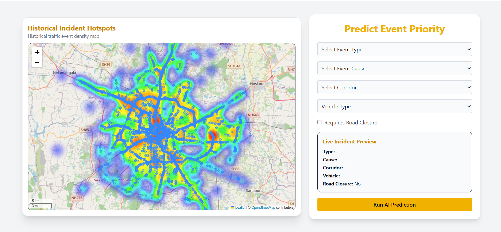
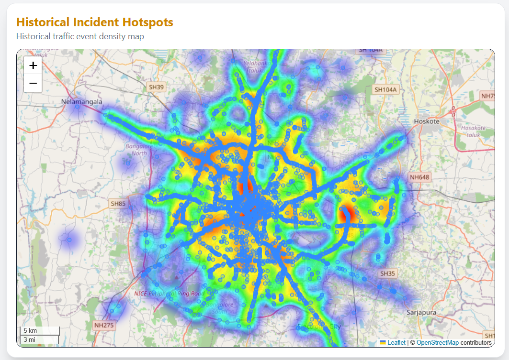
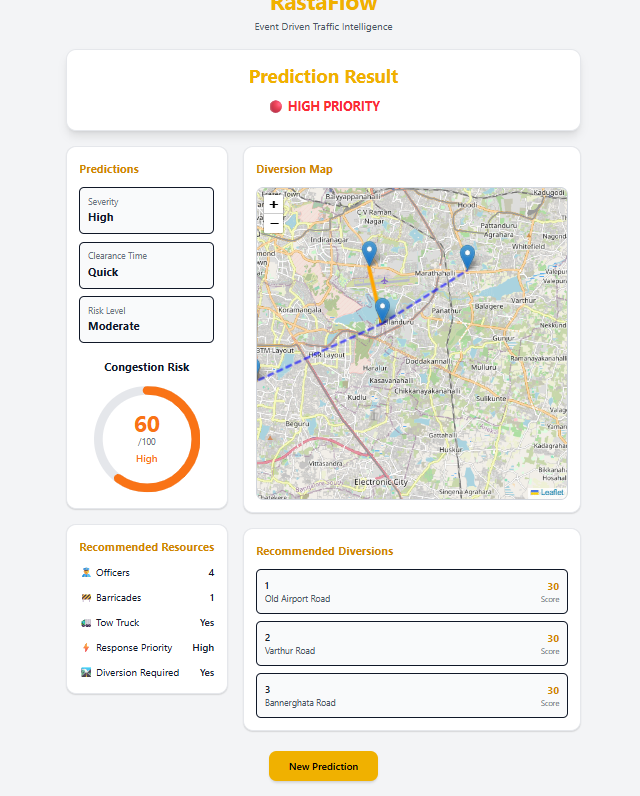
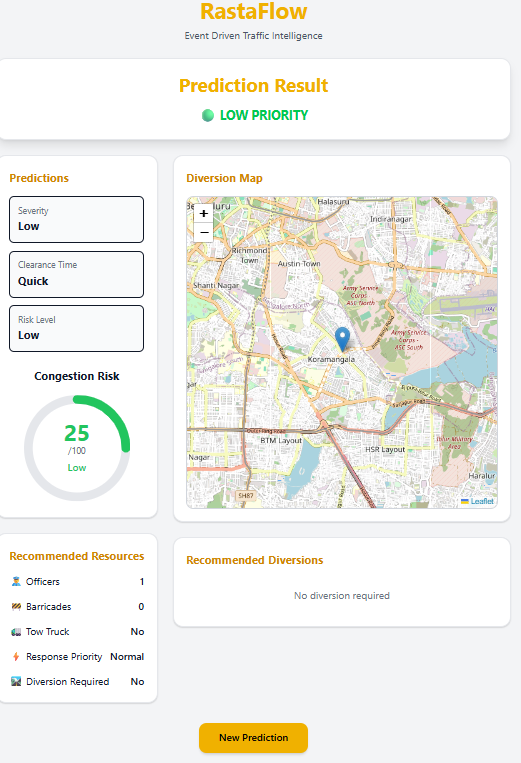

# RastaFlow AI – Intelligent Traffic Incident Prediction & Diversion Management System

An AI-powered traffic management platform that predicts incident severity, estimates clearance time, visualizes congestion hotspots, and recommends diversion routes to improve urban traffic flow.

---

## 🔧 Tech Stack


### Frontend

* React
* TypeScript
* Tailwind CSS
* Axios
* Recharts
* React Leaflet

### Backend

* FastAPI
* Python
* CatBoost
* Scikit-learn
* Pandas
* NumPy

### Other Tools

* OpenStreetMap
* Leaflet Maps
* Machine Learning Models
* Git & GitHub

---

## 🚀 Features

### 🚦 Incident Analysis

* Predict incident severity using AI models
* Estimate road clearance time
* Generate AI-based traffic recommendations
* Analyze traffic conditions instantly

### 🗺️ Traffic Visualization

* Interactive traffic dashboard
* Congestion heatmap visualization
* Real-time road condition display
* Geospatial traffic insights

### 🚗 Route Management

* Diversion route suggestions
* Alternate route recommendations
* Traffic-aware navigation support
* Road congestion avoidance

### 📊 Analytics Dashboard

* Severity prediction charts
* Clearance time analytics
* Traffic trend visualization
* Interactive data exploration

---

## 📁 Folder Structure

```text
RastaFlowAI/
│
├── backend/
│   ├── app.py
│   ├── predictor.py
│   ├── requirements.txt
│   └── model/
│
├── frontend/
│   ├── public/
│   ├── src/
│   │   ├── components/
│   │   ├── pages/
│   │   ├── services/
│   │   ├── assets/
│   │   ├── App.tsx
│   │   └── main.tsx
│   ├── package.json
│   └── vite.config.ts
│
├── dataset/
│
├── models/
│
└── README.md
```

---

## 🛠️ Setup Instructions

### 📦 Backend

```bash
cd backend
pip install -r requirements.txt
uvicorn app:app --reload
```

### Make sure your backend dependencies are installed

```bash
pip install fastapi uvicorn pandas numpy scikit-learn catboost
```

### 📦 Frontend

```bash
cd frontend
npm install
npm run dev
```

---

## 🎨 UI / UX Designs

A quick visual walkthrough of the **RastaFlow AI** platform showcasing traffic analysis, prediction, and route management features.

### 🏠 Dashboard

| Dashboard                                 | Heatmap                               |
| ----------------------------------------- | ------------------------------------- |
|  |  |

---


### 🛣️ Results

| With Diversions                                                      | Without Diversions                                                |
| -------------------------------------------------------------------- | ----------------------------------------------------------------- |
|  |  |

---

## 📌 Future Enhancements

* Real-time traffic API integration
* Dynamic route optimization
* Congestion forecasting using time-series models
* Multi-city deployment support
* Emergency vehicle prioritization
* AI-driven traffic signal coordination
* Live incident reporting system
* Mobile application support

---

## 🧑‍💻 Authors

**Team RastaFlow AI**

* **Nandini Bhardwaj** – GitHub: https://github.com/Nandini-Sha

---

## 🌐 Project Links

* GitHub Repository: https:https://github.com/Nandini-Sha/JobMosaic-job-platform.git
* Live Demo: https:https://rasta-flow.vercel.app/

---

## 📄 License

This project is licensed under the MIT License.
