# RastaFlow AI – Intelligent Traffic Incident Prediction & Diversion Management System

An AI-powered traffic management platform that predicts incident severity, estimates clearance time, visualizes congestion hotspots, and recommends diversion routes to improve urban traffic flow.

**🌍 Live Demo:** [https://rasta-flow.vercel.app](https://rasta-flow.vercel.app)
  
---

## 🔧 Tech Stack


### Frontend

* React
* TypeScript
* Tailwind CSS
* Axios
* Recharts
* React Leaflet

### Backend

* FastAPI
* Python
* CatBoost
* Scikit-learn
* Pandas
* NumPy

### Other Tools

* OpenStreetMap
* Leaflet Maps
* Machine Learning Models
* Git & GitHub

---

## 🚀 Features

### 🚦 AI Incident Analysis & Prediction
* Predict incident severity using CatBoost AI models
* Estimate road clearance time dynamically
* Generate AI-based traffic diversion recommendations
* Analyze real-time traffic conditions instantly

### 📱 Citizen Reporting Portal (Mobile-Optimized)
* Dedicated interface for citizens to report live incidents
* Dual upload options: Direct Camera Capture & Gallery Upload
* Client-side image compression for ultra-fast, bandwidth-saving uploads
* Dynamic location & incident type mapping

### 👮 Live Command Center (Officials)
* Real-time incident feed synchronized with MongoDB
* Official authentication for secure incident management
* One-click "Predict Impact" to pipe live reports directly into the AI model
* Mobile-responsive incident cards for on-the-go management
* Instant resolve/delete functionality

### 📈 Strategic Insights & Analytics
* Real-time aggregation of active vs. resolved incidents
* Dynamic average clearance time calculations based on live data
* Severity breakdowns and KPI metric tracking
* Interactive data exploration and dashboarding

### 📲 Progressive Web App (PWA)
* Installable natively on Android & iOS devices directly from the browser
* Native-like full-screen experience with viewport-fit optimizations
* Seamless "Install App" prompt for quick mobile deployment

---

## 📁 Folder Structure

```text
RastaFlowAI/
│
├── backend/
│   ├── app.py
│   ├── predictor.py
│   ├── requirements.txt
│   └── model/
│
├── frontend/
│   ├── public/
│   ├── src/
│   │   ├── components/
│   │   ├── pages/
│   │   ├── services/
│   │   ├── assets/
│   │   ├── App.tsx
│   │   └── main.tsx
│   ├── package.json
│   └── vite.config.ts
│
├── dataset/
│
├── models/
│
└── README.md
```

---

## 🛠️ Setup Instructions

### 📦 Backend

```bash
cd backend
pip install -r requirements.txt
uvicorn app:app --reload
```

### Make sure your backend dependencies are installed

```bash
pip install fastapi uvicorn pandas numpy scikit-learn catboost
```

### 📦 Frontend

```bash
cd frontend
npm install
npm run dev
```

### 📱 PWA Installation (Mobile)

To install the RastaFlow app on your mobile device:
1. Open the web app on your phone's browser (Chrome/Safari).
2. Look for the blue **"Install RastaFlow"** banner at the bottom of the screen.
3. **Android:** Tap "Install" to instantly add it to your home screen.
4. **iOS:** Tap the "Share" icon at the bottom of Safari and select "Add to Home Screen".

---

## 🎨 UI / UX Designs

A quick visual walkthrough of the **RastaFlow AI** platform showcasing our new mobile-optimized views, real-time analytics, and operational command tools.

### 📱 Citizen Reporting Portal
| Report an Incident |
| :---: |
| 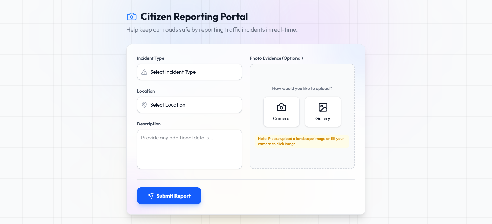 |

### 👮 Official Operations Center
| Official Login | Live Traffic Command |
| :---: | :---: |
| 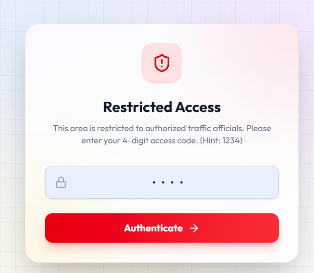 | 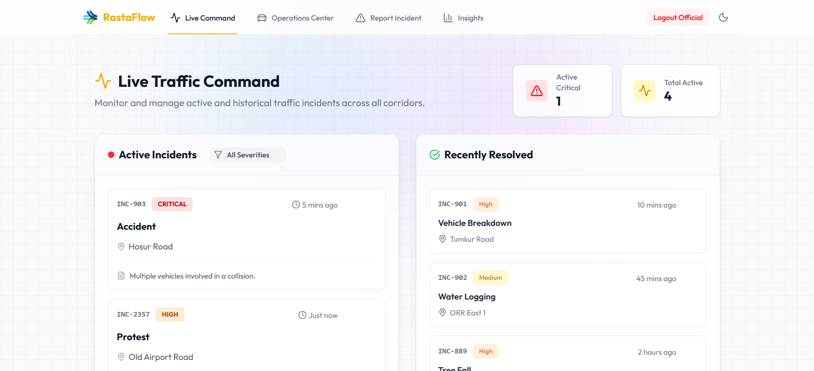 |

| AI Prediction & Operation Center |
| :---: |
| 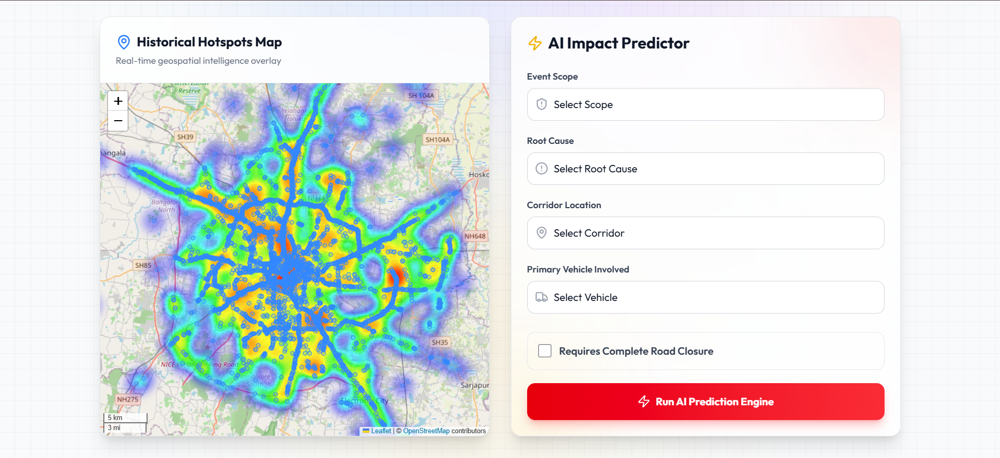 |

### 📈 Strategic Insights (Analytics)
| Analytics Overview 1 | Analytics Overview 2 | Analytics Overview 3 |
| :---: | :---: | :---: |
| 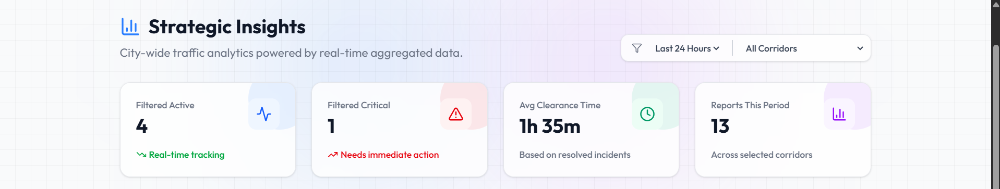 | 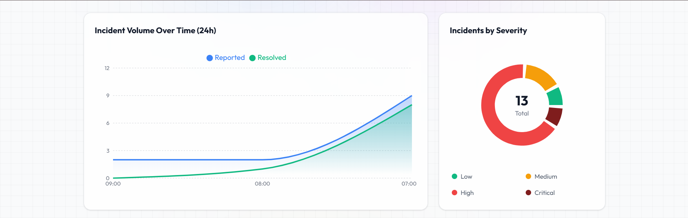 | 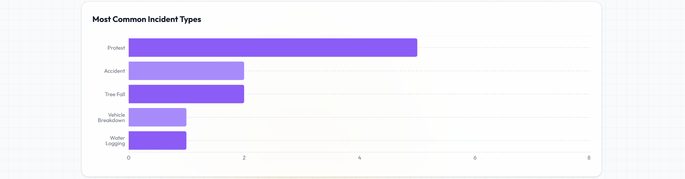 |

### 🛣️ AI Prediction Results
| Prediction Insight |
| :---: |
| 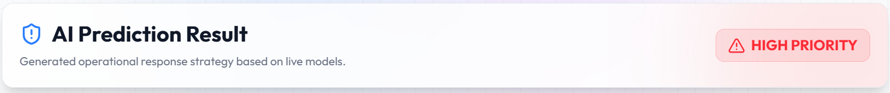 |
| 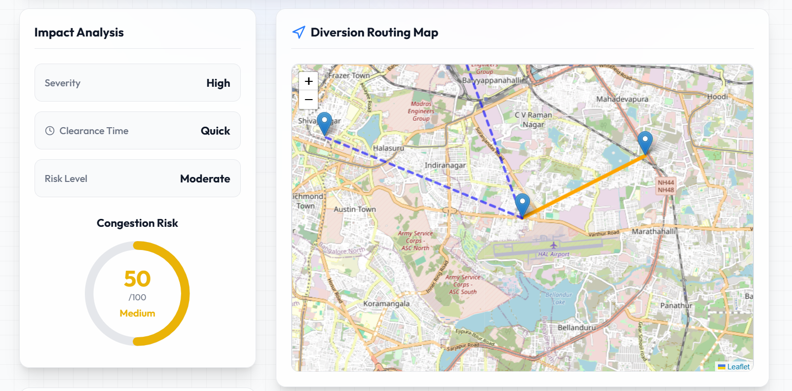 |
| 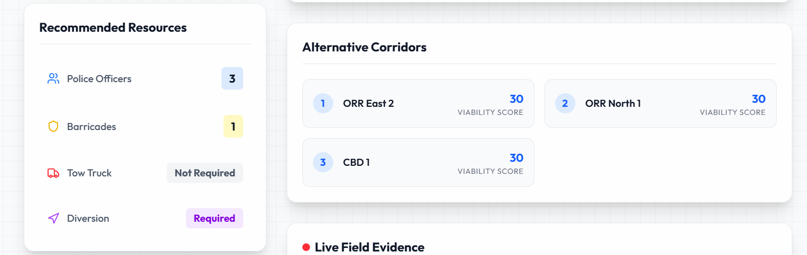 |

### 🌙 Themes
| Dark Mode UI for Dark mode Lovers|
| :---: |
| 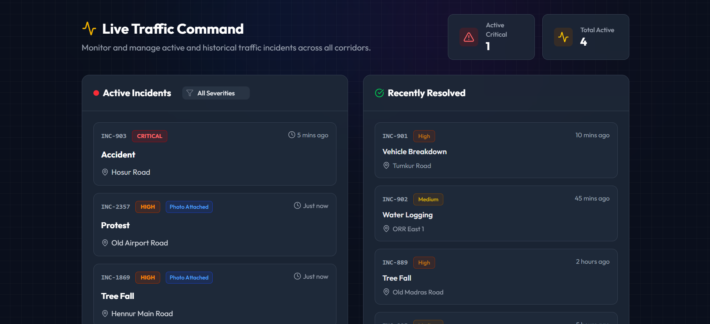 |

---

## 📌 Future Enhancements

* Real-time traffic API integration
* Dynamic route optimization
* Congestion forecasting using time-series models
* Multi-city deployment support
* Emergency vehicle prioritization
* AI-driven traffic signal coordination

---

## 🧑‍💻 Authors

**Team RastaFlow AI**

* **Nandini Bhardwaj** – GitHub: https://github.com/Nandini-Sha

---

## 📄 License

This project is licensed under the MIT License.
